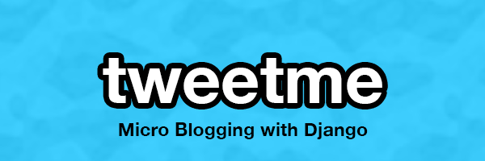

# TweetMe

Social media has changed the way we communicate with each other. The power behind social media allows us to do amazing things together. What exactly is behind it? Well.. it's Simple Web Application concepts that can be applied to ALL and ANY web applications that you may build.

Live course [here](https://kirr.co/2rhxyn)

In this course I learned what's behind how Twitter works. Now, Twitter has hundreds of developers so what I built is the basis of what Twitter once was, the absolute most simple things by learning more Django along the way.

What have I accomplished from this course?

* Built a real service like Twitter.com

* Got a deeper understanding of Django

* Built projects that rely on an API using the Django Rest Framework

* Worked with AJAX and jQuery

* Auto-generated hashtags and hashtag filter (#yourtag)

* Built projects using Django 1.10

* Integrated Bootstrap (getbootstrap.com) as a front end framework
